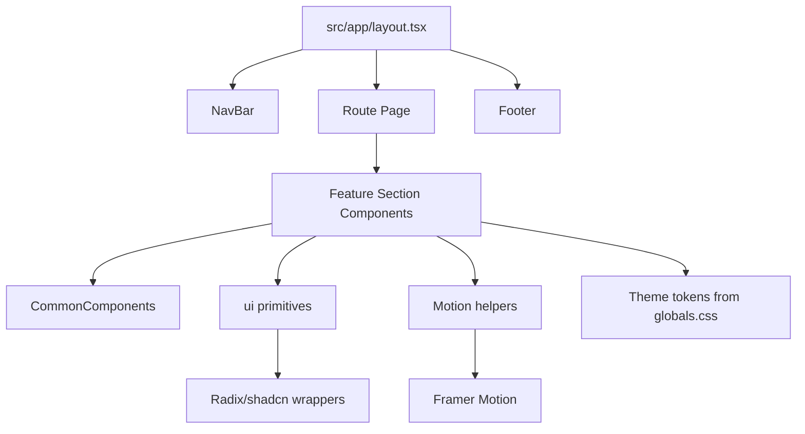

# Famora Architecture

## 1. Overview

Famora is implemented as a Next.js App Router application with route-level page composition and section-based UI modules.

Architecture style:

- Route composition in `src/app`
- Feature-grouped section components in `src/components`
- Shared shell (navigation + footer) in root layout
- Design tokens and theming in `src/app/globals.css`
- Utility primitives in `src/components/ui` and `src/lib`

## 2. High-Level Module Graph

## 3. Routing Architecture

Each route file under `src/app/<route>/page.tsx` acts as an orchestration layer that imports and renders page sections in sequence.

Routes currently implemented:

- `/`
- `/features`
- `/pricing`
- `/faq`
- `/how-it-works`
- `/about`
- `/contact`
- `/get-started`

Shared shell behavior:

- `src/app/layout.tsx` wraps all routes with global `<NavBar />` and `<Footer />`
- Global metadata is also defined in `layout.tsx`

## 4. Component Organization

The codebase uses domain-focused folders for page sections:

- `HomeComponents`
- `FeaturesComponents`
- `PricingComponents`
- `FAQComponents`
- `AboutComponents`
- `ContactComponents`
- `HowItWorksComponents`
- `GetStartedComponents`

Cross-cutting groups:

- `CommonComponents`: reusable section-level building blocks
- `ui`: lower-level primitives (button, dialog, tabs, collapsible, skeleton)

Design pattern used:

- Route pages are intentionally thin
- Most UI and behavior live inside section components
- Shared behavior is extracted to common helpers where practical

## 5. Styling and Theming

Styling stack:

- Tailwind CSS v4
- `tw-animate-css`
- shadcn stylesheet integration

Theme model:

- CSS variables declared in `:root` in `src/app/globals.css`
- Variables exposed as Tailwind tokens through `@theme inline`
- Brand palette is warm neutral with accent gold and WhatsApp green

Typography:

- Geist and Geist Mono are loaded via `next/font/google`

## 6. Client/Server Boundary

The app primarily renders static marketing content.

Client components are used for:

- Navigation interactions (`NavBar` mobile dialog)
- Motion and reveal effects (`MotionReveal`, `MotionStagger`)
- Interactive content blocks (tabs, collapsibles, dialogs)
- Checkout UI state management on `/get-started`

There are currently no server actions, API routes, or backend data integrations in this repository.

## 7. Interaction and Animation Layer

Animation utilities are centralized in `src/components/CommonComponents/MotionReveal.tsx`.

Patterns used:

- Scroll-triggered reveal (`whileInView`)
- Staggered child animation for content lists/cards
- Small, composable wrappers to keep section code readable

## 8. Build and Quality Tooling

- TypeScript strict mode enabled
- ESLint configured via Next core-web-vitals + TypeScript presets
- npm scripts:
	- `dev`
	- `build`
	- `start`
	- `lint`

## 9. Known Gaps

- Checkout and success dialog are presentation-level only, not connected to a payment backend
- Footer includes links for routes that are not implemented yet:
	- `/blog`
	- `/privacy-policy`
	- `/terms-of-service`
	- `/cookie-policy`

## 10. Evolution Path

Recommended next architecture milestones:

1. Add typed content/data layer for section content (local JSON or CMS)
2. Introduce route-specific metadata exports for SEO completeness
3. Integrate real billing + onboarding API for `/get-started`
4. Add telemetry/events for CTA and conversion funnel tracking
5. Add tests (component + route smoke tests)
